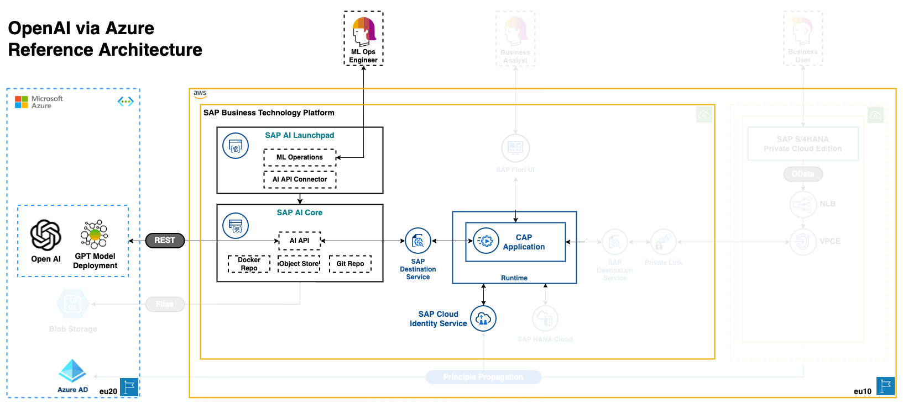

# Consume OpenAI services (GPT) through CAP & SAP AI Core

> [!IMPORTANT]
> Given the recommendation to utilize the [generative AI hub](https://www.sap.com/events/teched/news-guide/ai.html#article8) (General Availability Q4/2023) for foundational model access, we kindly refer to [btp-cap-genai-rag](https://github.com/SAP-samples/btp-cap-genai-rag) to understand the process of establishing a connection from CAP through the Generative AI Hub to Azure OpenAI

With AI Core as a proxy for Azure OpenAI Services, we are able to perform prompt engineering, e.g. to add more context in the form of (SAP) documents or to perform input validation. This sample implements parts of the [Reference architecture of an SAP BTP CAP application using GPT Models of OpenAI](https://github.com/SAP/sap-btp-reference-architectures/tree/main/hyperscalers/openai) and serves as a starting point for such a raw proxy and shows how SAP AI Core can be consumed and exposed via a CAP API.

## Requirements

In order to be able to carry out the steps for setup and deployment, an SAP BTP Subaccount is required, as well as the necessary entitlements. Provision the infrastructure and set the entitlements on SAP BTP by performing the steps of [setup Global Account and Subaccount in order to deploy the respected components](/documentation/00-prerequisites/01-setup-subaccount-cf-aicore.md).

### Prerequisited services and accounts

- SAP BTP Subaccount
- SAP AI Core instance
- SAP AI Launchpad subscription (recommended)
- SAP BTP, Cloud Foundry Runtime
- Destination Service
- SAP Authorization and Trust Management Service
- Azure OpenAI Service with Base URL (endpoint) and API Key
- Docker Hub account (optional)

## Setup & Deployment

This sample is divided into two sub-projects and implements parts of the [Reference architecture of an SAP BTP CAP application using GPT Models of OpenAI](https://github.com/SAP/sap-btp-reference-architectures/tree/main/hyperscalers/openai) as shown and mentioned in the overview. The first describes how a proxy can be created via AI Core to consume Azure OpenAI services and the second part shows how an AI Core inference service (the actual proxy) can be consumed via a CAP API and exposed via an endpoint.

### 1. SAP AI Core as Proxy for Azure OpenAI Services

1. [Getting started with AI at SAP: SAP AI Launchpad and SAP AI Core](/documentation/01-ai-core-azure-openai-proxy/01-ai-sap-getting-started.md)
2. [Setup Docker Hub account and build & push your Docker Image (optional)](/documentation/01-ai-core-azure-openai-proxy/02-build-push-docker-images.md)
3. [Register general artifacts on SAP AI Core and inspect in SAP AI Launchpad](/documentation/01-ai-core-azure-openai-proxy/03-register-general-artifacts.md)
4. [Deploy the Inference Service on SAP AI Core as Proxy for Azure OpenAI Services](/documentation/01-ai-core-azure-openai-proxy/04-setup-deployment-inference-service.md)
5. [Test and play with deployed service](/documentation/01-ai-core-azure-openai-proxy/05-test-deployed-service.md)

### 2. CAP API: Expose Azure OpenAI Services via SAP AI Core Proxy

1. [Prepare for CAP API (Cloud Application Programming) deployment](/documentation/02-cap-api/01-prepare-cap-deployment.md)
2. [Deploy the CAP API](/documentation/02-cap-api/02-deploy-cap-api.md)
3. [Attach SAP AI Core to CAP via Destination](/documentation/02-cap-api/03-attach-aicore.md)
4. [Test CAP Endpoint](/documentation/02-cap-api/04-test-cap-endpoint.md)

## Known Issues

No known issues.

## How to obtain support

[Create an issue](https://github.com/SAP-samples/<repository-name>/issues) in this repository if you find a bug or have questions about the content.

For additional support, [ask a question in SAP Community](https://answers.sap.com/questions/ask.html).

## Contributing

If you wish to contribute code, offer fixes or improvements, please send a pull request. Due to legal reasons, contributors will be asked to accept a DCO when they create the first pull request to this project. This happens in an automated fashion during the submission process. SAP uses [the standard DCO text of the Linux Foundation](https://developercertificate.org/).

## License

Copyright (c) 2023 SAP SE or an SAP affiliate company. All rights reserved. This project is licensed under the Apache Software License, version 2.0 except as noted otherwise in the [LICENSE](LICENSE) file.
