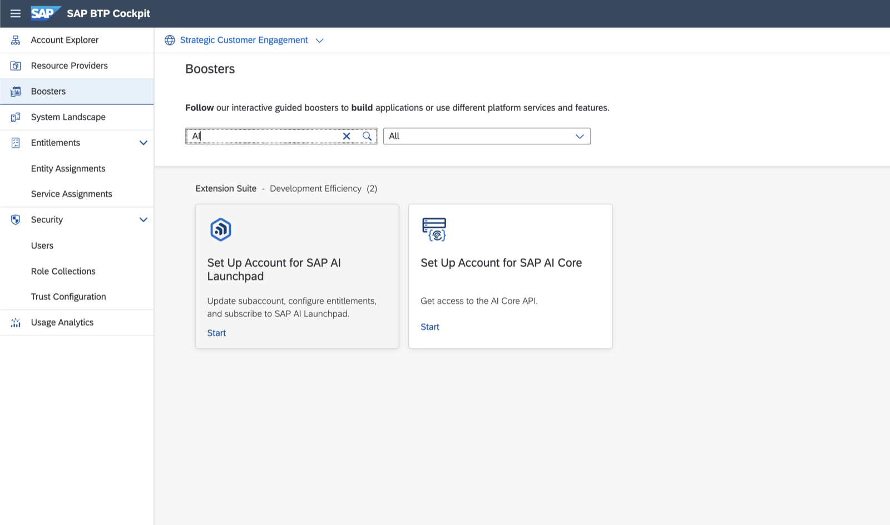
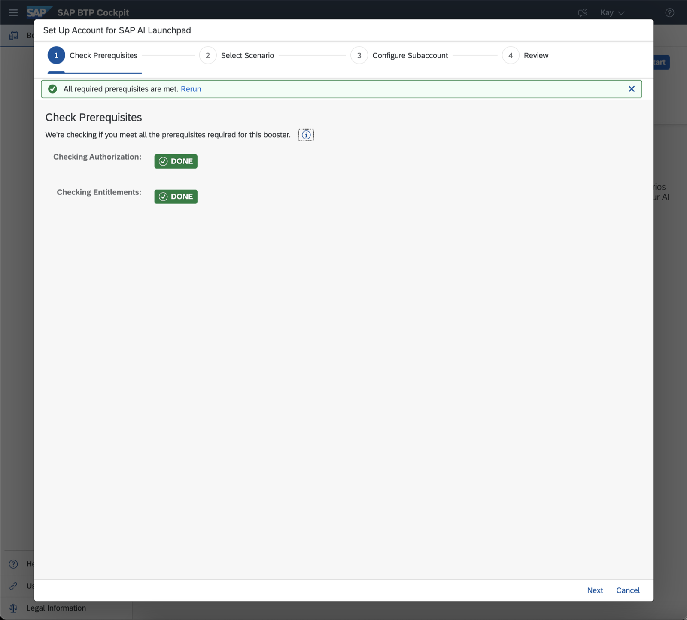
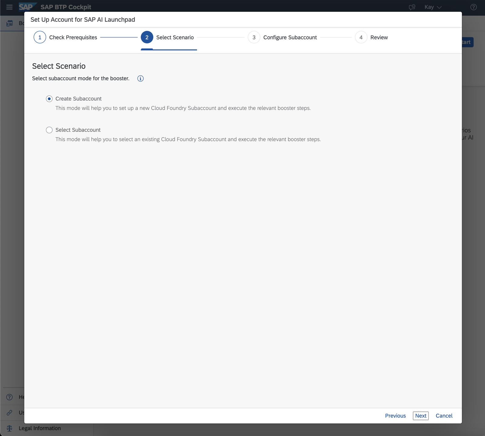
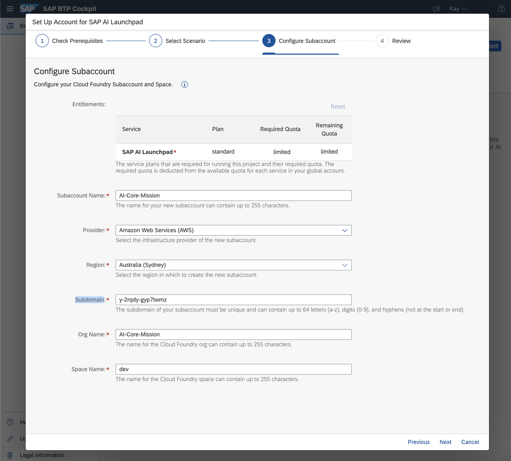
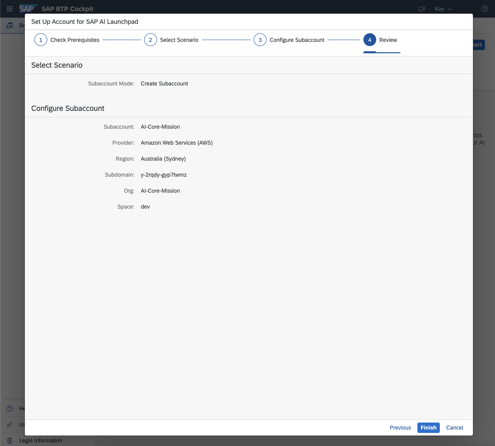
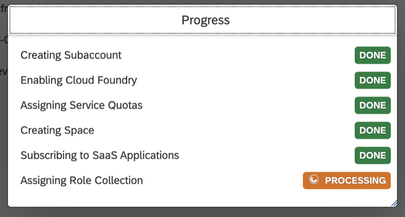
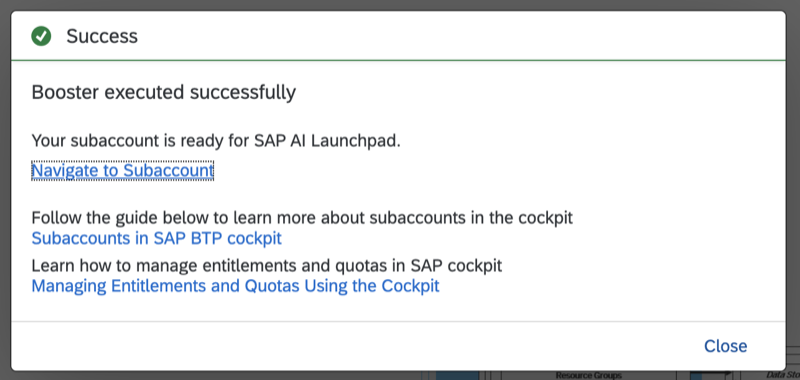
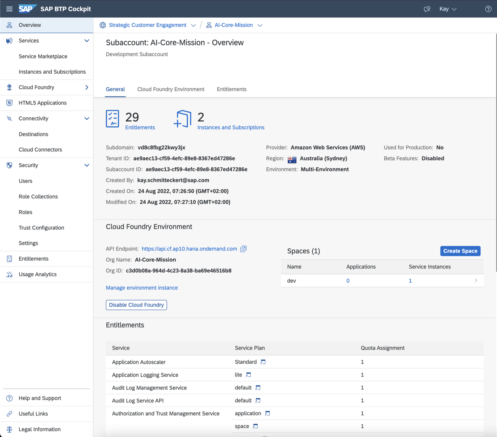
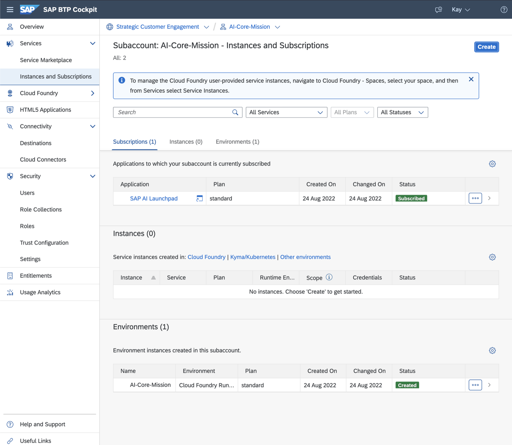

## Prerequisite

[Getting a Global Account](https://help.sap.com/docs/BTP/65de2977205c403bbc107264b8eccf4b/d61c2819034b48e68145c45c36acba6e.html)

## Create Subaccount with SAP AI Launchpad through Booster

Once the prerequisites are met, you can get started to create a subaccount with a subscription to SAP AI Launchpad through the help of a Booster. For this, join your global account and navigate to Boosters. Search for 'AI' to get a list of all available Boosters related to AI.

Choose the Booster for SAP AI Launchpad with the title 'Set Up Account for SAP AI Launchpad' and start it.

Follow the steps in the wizard to finish which triggers the setup of the subaccount with some additional configuration necessary to activate SAP AI Launchpad.

#### Step 1: Check Prerequisites

#### Step 2: Select Scenario

#### Step 3: Configue Subaccount

#### Step 4: Review

#### Progress of Booster

## Inspect Subaccount

After the Booster succeeded, navigate to your freshly created subaccount by clicking on 'Navigate to Subaccount'

The Overview of the Subaccount gives you a summary like metadata or spaces within the subaccount.

Navigate to the _Instances and Subscriptions_ to see the subscription to SAP AI Launchpad.

## Add Service Plans for SAP BTP, AI Core

To create service instances of SAP BTP, AI Core on a subaccount, one first has to add the respective service plan and give entitlements.

Follow the procedure from [Add a Service Plan](https://help.sap.com/docs/AI_CORE/2d6c5984063c40a59eda62f4a9135bee/86002d926eba4fb9ba0a80e342af7295.html?locale=en-US) on
from the overall guide [Provision AI Core (incl.
Subaccount)](https://help.sap.com/docs/AI_CORE/2d6c5984063c40a59eda62f4a9135bee/38c4599432d74c1d94e70f7c955a717d.html?locale=en-US).
Since a subaccount for the purpose of AI Launchpad was already created through the
booster, it's not necessary to follow the whole guide.

After the service plan is in place, [create a Service Instance of SAP BTP, AI Core](https://help.sap.com/docs/ai-core/ai-core/create-service-instance) and add a respective Service Key to this instance by perfoming the steps described [here](https://help.sap.com/docs/ai-core/ai-core/create-service-key) and add this as a new connection to SAP AI Launchpad following the steps describe [here](https://help.sap.com/docs/ai-launchpad/sap-ai-launchpad/add-connection-to-sap-ai-core).

If not done yet, clone this repository ([SAP-samples/azure-openai-aicore-cap-api](https://github.com/SAP-samples/azure-openai-aicore-cap-api)) to further proceed with setting up the proxy.
