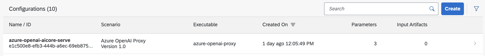
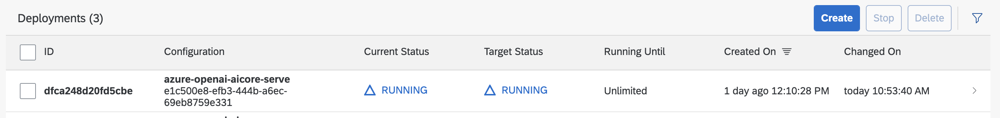

# Setup and Deployment of Inference service in AI Core

To deploy a proxy (as an inference service), you first need to create a serving configuration. It keeps
information about which scenario to use, what the parameters and artifacts to use as well as some more metadata like the ID of the AI Scenario. Please execute the following steps from the [proxy.ipynb](../../01-ai-core-azure-openai-proxy/proxy.ipynb) to achieve the inference deployment.

## Serving Configuration

The configuration serves some metadata, like the ID of the AI Scenario and which workflow
to use for serving. Further, one has to specify what artifacts and parameters to use for serving, which
in this case is paremeters for the docker repository as well as for the Azure OpenAI service. To create the configuration, execute the following code:

```python
# Create another AI API client to use different base url.
ai_api_v2_client = AIAPIV2Client(
    base_url=aic_service_key["serviceurls"]["AI_API_URL"] + "/v2/lm",
    auth_url=aic_service_key["url"] + "/oauth/token",
    client_id=aic_service_key["clientid"],
    client_secret=aic_service_key["clientsecret"],
    resource_group=resource_group)

with open(serving_workflow_file) as swf:
    serving_workflow = yaml.safe_load(swf)

scenario_id = serving_workflow["metadata"]["labels"]["scenarios.ai.sap.com/id"]
executable_name = serving_workflow["metadata"]["name"]

with open(env_file_path) as efp:
    environment_values = json.load(efp)

parameter_bindings = [ParameterBinding(key=key, value=value) for key, value in environment_values.items()]


serve_configuration = {
    "name": f"{resource_group}-serve",
    "scenario_id": scenario_id,
    "executable_id": executable_name,
    "parameter_bindings": parameter_bindings,
    "input_artifact_bindings": []
}

serve_config_resp = ai_api_v2_client.configuration.create(**serve_configuration)

assert serve_config_resp.message == "Configuration created"

pprint(vars(serve_config_resp))
print("configuration for serving the model created")
```

If the serving configuration has been created successfully, it should show up
in AI Launchpad under the ML Operations > Configurations tab:



## Serve the proxy as inference service

AI Core can now use the information from the serving configuration to finally deploy the service that makes the proxy available for inference requests. To do so,
run this code:

```python
deployment_resp = ai_api_v2_client.deployment.create(serve_config_resp.id)
pprint(vars(deployment_resp))

# Poll deployment status.
status = None
while status != Status.RUNNING and status != Status.DEAD:
    time.sleep(5)
    clear_output(wait=True)
    deployment = ai_api_v2_client.deployment.get(deployment_resp.id)
    status = deployment.status
    print("...... deployment status ......", flush=True)
    print(deployment.status)
    pprint(deployment.status_details)

    if deployment.status == Status.RUNNING:
        print(f"Deployment with {deployment_resp.id} complete!")

# Allow some time for deployment URL to get ready.
time.sleep(10)
```

AI Core will need some time now to finish the deployment of the service. Once
the proxy has been deployed the deployment should be marked as _RUNNING_ in AI
Launchpad under the Deployments tab where you are also able to see your Deployment ID:


